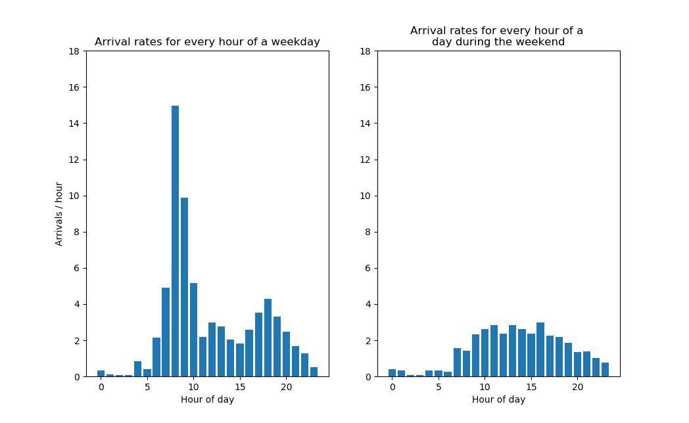
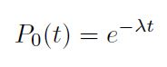
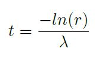
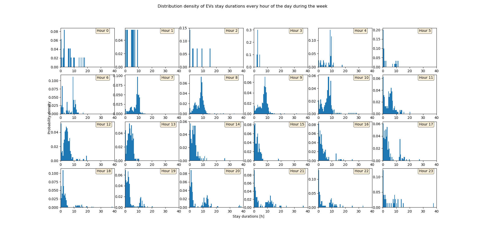
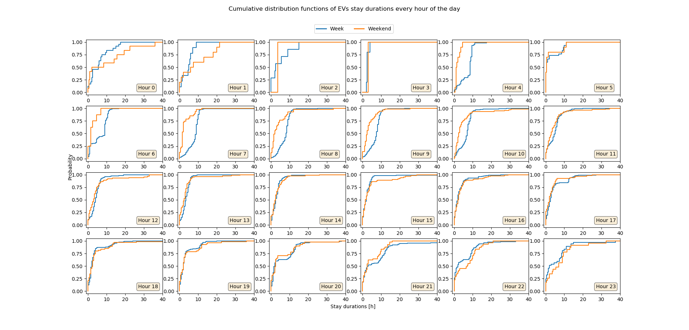
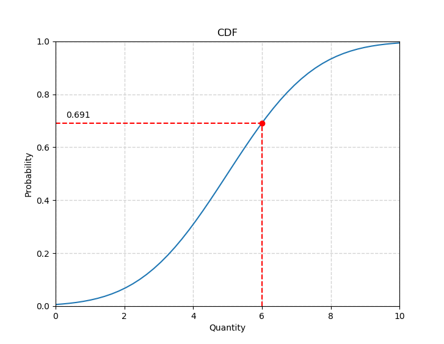

Statistical Model
=================

To model the behavior of the EVs using the ACN network in terms of arrival patterns, stay durations and energy demand,
a data-driven empirical statistical model is used. This is done by dividing the collected data from the real
ACN into hourly distributions depending on when they arrive. This is because the behavior of the EVs depends highly on the
time of the day. For example, an EV arriving around 8-9am would very likely stay for around 8 hours as the the owner is
probably parking for a workday, but an EV arriving around 7pm would most likely stay for 1-2 hours as the owner is most
probably going to the gym located close by.

The statistical model is created at runtime and is based on a data set. Which file this set should be
taken from is specified in the file ``config.py``. Change the string ``stat_model_data_source`` to the file that should source
the data. It is also possible to change the time offset to compensate for timezones with ``time_zone_diff_hour`` (If the specified
timezone in the data is not the same as the timezone of the location where the data was collected).

Arrival times
-------------

A poisson process is used to model the arrival times of the EVs. As the behavior of the EVs change depending on the time
of the day and if it is a day during the week or the weekend, variable arrival rates are used. These rates are derived from
the collected data and an example for a data set is presented below.

    Arrival rates for every hour on a weekday or a day during the weekend. From this figure it easy to see that
    the arrival rates depend strongly on the time of the day and the week.

The poisson process is used to calculate the time between two arrivals. The formula describing the probability that
no arrivals has happened during the time `t` is:

To use this formula to generate the time between two arrivals, the time `t` is solved for and the probability will be a
uniform random variable in the range (0,1]:

The time `t` is calculated between every generated session by generating the random variable `r`
and the rate `lambda` is set by the time of the day by using a lookup table from the statistical model.

Stay duration
-------------

To model the stay duration of every charging session the distribution densities for every hour is calculated. Some example plots
for the stay duration distributions during the week is presented in the figure below. From this figure it is possible to
observe that the stay duration depends heavily on the time of arrival of the EV.

    The stay duration probability density functions (PDF) for every hour during the week. There is a similar figure for
    the distributions of the weekend.

The area of every distribution adds up to 1 and integrating over the PDFs gives the Cumulative Distribution Functions (CDFs)
from where the stay durations can be generated from. The CDFs from the statistical model are visualized in the figure below.

    The stay duration Cumulative Distribution functions (CDF) for every hour of a day during the week and also the weekend.
    From this figure it is possible to see that the stay behavior depends on the day of the week as well.

Selecting the stay duration
+++++++++++++++++++++++++++

When the CDFs have been determined it is easy to generate the stay duration by generating a uniform random variable in
the interval [0, 1]. For example, in the figure shown below there is a CDF describing a probability distribution. The
random number 0.691 was generated from a uniform distribution in the interval [0, 1] and by selecting the point on the CDF
where this number occurs, the stay duration (of 6 hours in this case) can be determined by following this point down to the x-axis.

Energy demand
-------------

The energy demand is determined in the same manner as the stay durations, by dividing the days to belong to weeks or weekends
and then dividing every day into each hour. For every hour a PDF is calculated and then integrated to a CDF from where
the energy demand for the EV will be determined.

