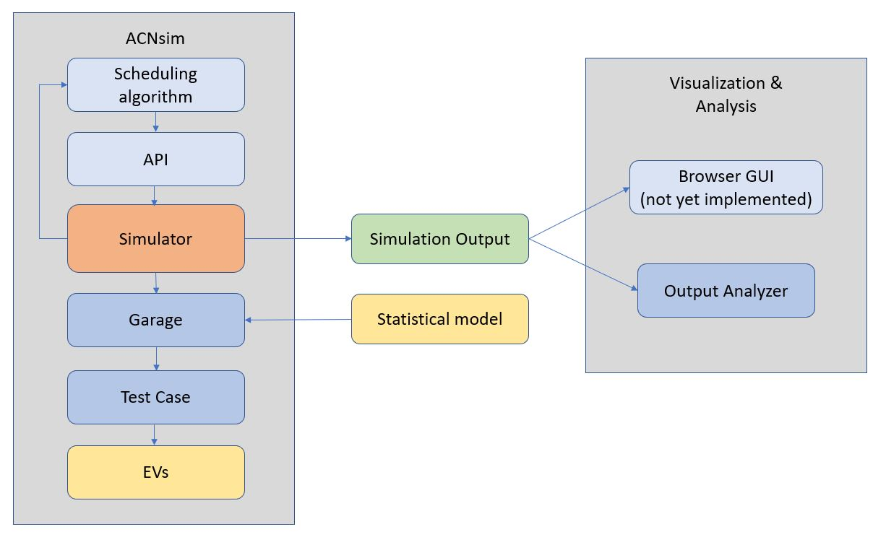

Program structure
=================

The ACN-portal simulation module is divided into several abstraction layers to handle different parts of
the simulation. This makes it easier to get an overview of the program and to make further changes to the code.

The main abstraction layers are:
    - Charging algorithm (Defined by the user and extends the :class:`BaseAlgorithm<sim.BaseAlgorithm.BaseAlgorithm>` class)
    - Interface (The interface between the charging algorithm and the simulator)
    - Simulator (The main layer. Runs the simulation loop)
    - Garage (Models the infrastructure)
    - TestCase (Holds the information about the charging sessions)

Alongside the layers mentioned above are some other classes to provide functionality to the simulation module:
    - ACNsim (This class handles all the interconnections of the other classes to make the simulation module run efficiently.This is the main class the user will use to run their simulations.)
    - StatModel (Builds a model of the arrivals, stay durations and energy demand. Used to by the ``Garage`` to generate a test case to run the simulation on)

A simplified view of the structure is presented in the figure below:

    The internal structure of the ACN portal simulator module

When the simulation has run to completion the simulation data will be returned to the user in a
:class:`SimulationOutput<sim.acnlib.SimulationOutput.SimulationOutput>` object. During the simulation the SimulationOutput object
is stored in the test case and upon completion it is iterated upwards from the test case through the abstractions layers
to gather additional simulation data.

To analyze the simulation output there is another class called :class:`OutputAnalyzer<sim.acnlib.OutputAnalyzer.OutputAnalyzer>` that
extracts and presents the data from the ``SimulationOutput`` object with graphs of relevant measurements.