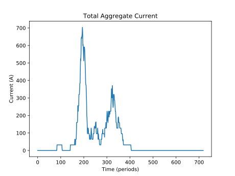

Lesson 1: Running an Experiment
===============================

In this first lesson we will learn how to setup and run a simulation using a built-in scheduling algorithm. After running the simulation we will learn how to use the analysis subpackage to analyze the results of the simulation.

Imports
*******

We begin with the necessary package imports. ::

    import pytz
    from datetime import datetime
    from matplotlib import pyplot as plt

    from acnsim.simulator import Simulator
    from acnsim.network.sites import CaltechACN
    from acnsim.events import EventQueue
    from acnsim.utils.generate_events import generate_test_case_api
    from acnsim.analysis import *
    from algorithms import UncontrolledCharging

Experiment Parameters
*********************

Next we need to define some parameters of the experiment. We define these at the begining of the file so they can be
used consistently when setting up the simulation. ::

    # Timezone of the ACN we are using.
    timezone = pytz.timezone('America/Los_Angeles')

    # Start and End times are used when collecting data.
    start = datetime(2018, 9, 5).astimezone(timezone)
    end = datetime(2018, 9, 6).astimezone(timezone)

    # How long each time discrete time interval in the simulation should be.
    period = 5  # minutes

    # Voltage of the network.
    voltage = 220  # volts

    # Default maximum charging rate for each EV.
    max_rate = 32 # amps

    # Identifier of the site where data will be gathered.
    site = 'caltech'

Network
*******
An important part of any simulation is the ChargingNetwork on which it runs. The ChargingNetwork is a description of the
physical system and contains both the set of EVSEs which make up the network as well as a ConstraintSet which represents
the electrical infrastructure of the network. You can manually configured this network using the register_evse() and
add_constraint() methods in ChargingNetwork or you can use a predefined network available in the sites module. In this
case we use the predefined CaltechACN network. ::

    cn = CaltechACN(basic_evse=True)

Events
******
Events are what drive action in the simulator. Events are stored in an EventQueue. This queue can be built manually by
creating an Event object and using the add_event() or add_events() methods, or can be generated automatically.

In this case we will use c2api.generate_events() which is part of the events subpackage. c2api provides utilities for
generating events from the Caltech Charging Dataset. These events are based on real behavior of users charging actual
EVs, so it is extremely valuable for running realistic simulations. In order to access the API we need a *token*. For
now we can use the demo token, but it is *highly recomended* that you register for your own free token at
ev.caltech.edu. ::

    API_KEY = 'DEMO_TOKEN'
    events = c2api.generate_events(API_KEY, site, start, end, period, voltage, max_rate)

Scheduling Algorithm
********************
The primary purpose of acnportal is to evaluate scheduling algorithms for large-scale EV charging. We will discuss how
develop your own custom algorithm in Lesson 2, for now we will use one of the builtin scheduling algorithms,
UncontrolledCharging. ::

    sch = UncontrolledCharging()

Simulator
*********
We next need to set up our simulation enviroment using the parts we have already defined. The Simulator constructor
takes in a ChargingNetwork, Algorithm, and EventQueue. We also provide the start time of the simulation which all
internal timestamps will be measured relative to. Finally we pass in the length of each period as well as a parameter
called max_recomp. max_recomp controls how often the scheduling algorithm is called when no events occur. Here we have
set max_recomp to 1, meaning the scheduling algorithm will be called every time step. If we had set it to 5, up to 5
time steps could occur before the scheduling algorithm was called. Note that the scheduling algorithm is always called
when an event occurs. In this case, UncontrolledCharging only provides one charging rate, so it must be used with a
max_recomp of 1. ::

    sim = Simulator(cn, sch, events, start, period=period, max_recomp=1)

To run the simulation we can then simply call::

    sim.run()

Analysis
********
Once the simulator has been run, we can analyze the results. For this purpose acnsim offers a package called analysis.
One thing we may be interested in is the proportion of total users' energy demand that we were able to meet. To find
this we can use the proportion_of_energy_delivered() method from the analysis subpackage. The only argument to this
function is the Simulator object itself. ::

    total_energy_prop = proportion_of_energy_delivered(sim)
    print('Proportion of requested energy delivered: {0}'.format(total_energy_prop))

We may also be interested in the peak demand of the system as this determines our big the root transformers and cables
in our system must be as well as the demand charge we may have to pay. The Simulator has a built in property which keeps
track of this peak usage called peak. ::

    print('Peak aggregate current: {0} A'.format(sim.peak))

Finally, we can plot the output of our simulation. For now we will just plot total aggregate current draw::

    # Plotting aggregate current
    agg_current = aggregate_current(sim)
    plt.plot(agg_current)
    plt.xlabel('Time (periods)')
    plt.ylabel('Current (A)')
    plt.title('Total Aggregate Current')
    plt.show()

Results
*******
You are now ready to save and run the script.

You should see a play-by-play of events scrolling in your console::

    Plugin Event...
    Plugin Event...
    Plugin Event...
    Plugin Event...
    Plugin Event...
    ...
    Plugin Event...
    Unplug Event...
    Plugin Event...
    Unplug Event...
    Unplug Event...
    Unplug Event...
    Unplug Event...
    ...

This can help you gauge the progress of your simulation.

Once the simulation has finished running, you will see the results of our analysis::

    Proportion of requested energy delivered: 1.0
    Peak aggregate current: 704 A

The good news is that we delivered all of the requested energy. The bad news is that our peak aggregate current was
quite high. 704 A * 220 V = 155 kW while the transformer of the actual Caltech ACN is only rated for 150 kW.

Finally you should see a figure which looks similar to this:

**Congratulations** You just ran your first experiment with acnportal.

